## Descripción:
> Se crearán 4 contenedores con Docker:
> 1. Un contenedor con la imagen **mysql:debian**
> 2. Un contenedor con la imagen **php:apache-bullseye**: el cual contendrá el primer servidor que se construirá uitlizando **NodeJS** y responderá con una tabla en formato html.
> 3. Otro contenedor con la imagen  **php:apache-bullseye**: el cual contendrá el segundo servidor que también se construirá utilizando **NodeJS** y tendrá la misma respuesta que el primer servidor.
> 4. Finalmente, crearemos un contenedor con la imagen **haproxy:lataest**: el cual contendrá un balanceador de carga que redirigirá las peticiones alternando entre el primer y segundo servidor sucesivamente.

#### Funcionamiento:
Con un navegador de nuestra máquina deberemos hacer una petición a `http://localhost:8085` y este deberá recibir el sitio web que sirve el primer servidor. Luego de actualizar la página, nuestro balanceador deberá interceder y enviar la petición al segundo servidor, que servirá la misma página del servidor 1.
Ahora bien, nuestros servidores se comunicarán con una base de datos que se alojará en el contenedor de mysql. Esta base de datos tendrá algunos datos cargados a mano por nosotros mismos para que la simulación de una consulta a la base de datos por parte de nuestros servidores tenga sentido.


## Características
#### SO: Windows 10.

## Requerimientos:
1. Tener instalado **Docker Desktop**

## Procedimiento

### Primero descargamos las imágenes que necesitemos

Usamos el comando:
```
docker pull <nombre_de_la_imagen>
```

```
docker pull php:apache-bullseye
```

```
docker pull mysql:debian
```

```
docker pull haproxy:latest
```


### Creamos los contenedores

#### 1ro. Contenedor del gestor de bases de datos MySQL

```
docker run -d -p 3306:3306 -v "C:\Users\Usuario\Dropbox\DESCARGAS TEMPORALES CLASSROOMok\saIII-MicroServicios\contenedoresConApacheYMysql\mysqlVolumen":/var/lib/mysql --name mimsql -e MYSQL_ROOT_PASSWORD=pass mysql:debian
```

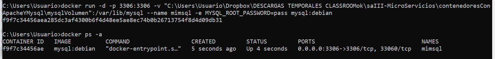

Vemos que estamos creando un **volumen**. Esta herramienta de **Docker** nos permite *guardar los datos* del sistema de archivos del contendor en la ruta `/var/lib/mysql` en nuestro sistema de archivos de nuestra máquina local `C:\Users\Usuario\Dropbox\DESCARGAS TEMPORALES CLASSROOMok\saIII-MicroServicios\contenedoresConApacheYMysql\mysqlVolumen`
Así, podremos crear tantas bases de datos, tablas y registros como queramos; y por más que eliminemos el contendor, estos datos no se perderán pues estarán guardados en el sistema de archivos de nuestra máquina local.

###### Importante:
La contraseña para este contenedor: **`-e MYSQL_ROOT_PASSWORD=pass` debe ser la misma que la que colocamos en nuestro fichero de conexión a la base de datos**.

##### Configuración del contenedor mysql

Para ingresar al contenedor ejecutamos:
```
docker exec -it mimsql bash
```

Luego para ingresar al gestor de bases de datos:
```
mysql -u root -p
```
Y proporcionamos la contraseña que le dimos al crear el contenedor, en nuestro caso: `pass`

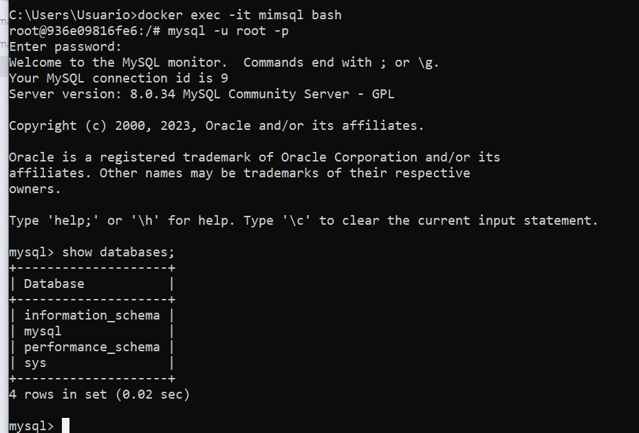

Con esto podremos empezar a crear datos para usar en nuestro ejemplo.

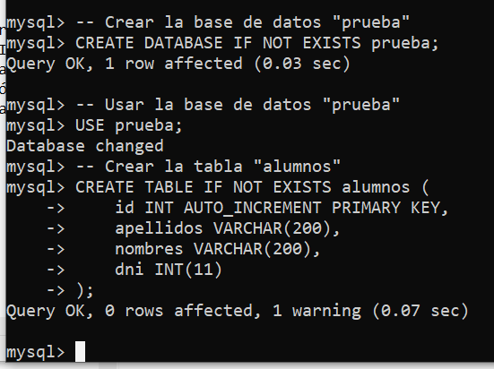

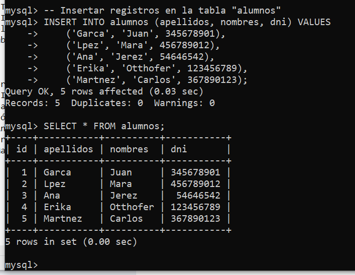

Para salir ejecutamos:
```
exit
```

Como debemos saber la IP de nuestro contenedor mysql para luego conectarlo con los contenedores de los servidores, ejecutamos:

```
docker inspect mimsql
```
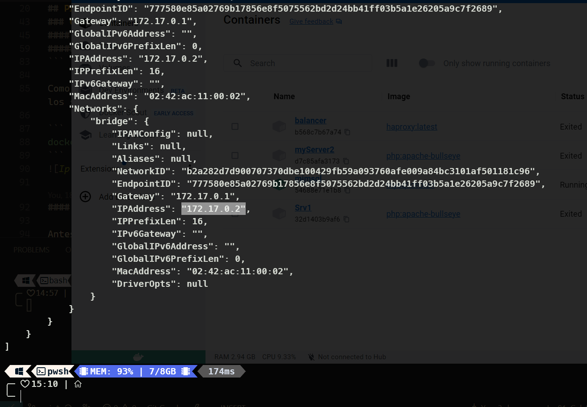.
Esta dirección  IP cambia cada vez que el contenedor se reinicia. Por lo tanto, deberemos consultar esta dirección cada vez que reiniciemos nuestro contenedor y hacer los cambios necesarios que reflejen tal cambio.

#### 2do. Contenedor del servidor 1 de php:apache **corriendo Node.js**

Antes de crear el contenedor debemos tener en cuenta algunas configuraciones.
##### Configuración de la conexión 
En este paso debemos asegurarnos de que nuestro servidor tendrá una parte de código donde debemos configurar la conexión a la base de datos (al contenedor de nuestro sistema gestor de bases de datos).
La configuración es:
```
// Configuración de la conexión a la base de datos MySQL
const db = mysql.createConnection({
    host: '172.17.0.2',
    user: 'root',
    password: 'pass',
    database: 'prueba',
});

```

Vemos que la variable `db` **alojará un objeto que devuelve el método createConnection() de la biblioteca `mysql2`**. Este método es el encargado de realizar la conexión a nuestra base de datos y **dentro de esta conexión configuramos la ip del contenedor que ejecuta el sistema gestor de bases de datos**.
La clave `password="pass"` del objeto de configuración es la misma que la usada al crear el contenedor.


##### Creamos el contenedor

```
docker run -d -p 8088:81 --name Srv1 -v C:\sitio1:/var/www/html php:apache-bullseye
```
El comando anterior funciona en PowerShell. **Si estamos en CMD ejecutar**:
```
docker run -d -p 8088:81 --name Srv1 -v "C:\sitio1":/var/www/html php:apache-bullseye
```


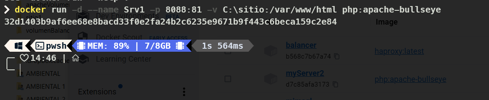

Vemos que estamos creando un volumen, que persistirá los datos del sistema de archivos del contendor en la ruta `/var/www/html` en nuestro sistema de archivos de nuestra máquina local `C:\sitio1`

###### Importante:
Es en esta ruta (`C:\sitio1`) donde deberá estar alojado el servidor de **NodeJS**. Así el contenedor del servidor creado podrá servir nuestro sitio web que se conectará con la base de datos del contenedor mysql.
Atendiendo lo anterior, procedemos a copiar los ficheros `package.json`, `package-lock.json` y `server.js` al directorio `C:\sitio1`.

##### Configuración del contenedor


Para ingresar al contenedor ejecutamos:
```
docker exec -it Srv1 bash
```

Actualizamos los paquetes instalados:
```
apt-get update
```


Observamos que los ficheros previamente copiados se encuentran dentro del servidor.
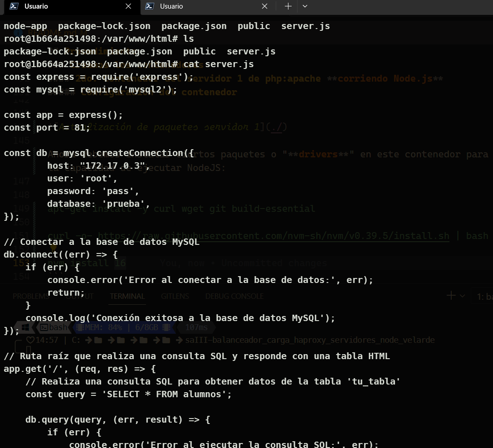

Ahora debemos instalar ciertos paquetes o "**drivers**" en este contenedor para que el servidor tenga la capacidad de ejecutar NodeJS:

###### Instalaciones dentro del contenedor
Para instalar Node utilizaremos **nvm** que es un gestor de versiones de Node. Por lo tanto, devemos instalar **nvm**. Sin embargo, para instalar nvm necesitaremos **curl**.

- Instalación de **`curl`**:
    ```
    apt-get install -y curl wget git build-essential
    ```

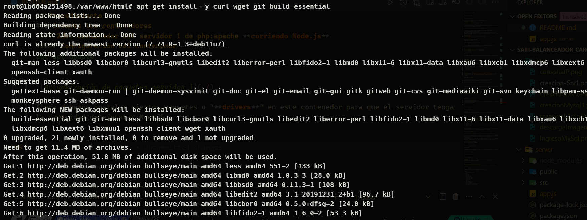

- Instalación de **`nvm`**:
    ```
    curl -o- https://raw.githubusercontent.com/nvm-sh/nvm/v0.39.5/install.sh | bash
    ```

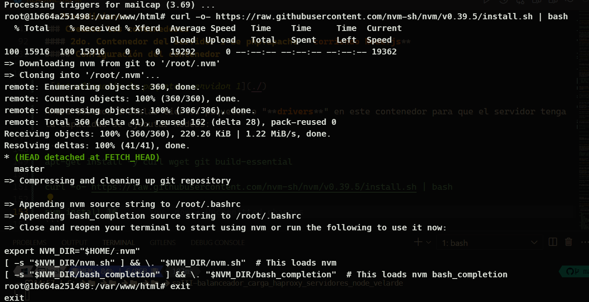

- Instalación de **`NodeJS`** *(versión 16)*:
    ```
    nvm install 16
    ```


##### Otros
Finalmente, con todo lo anterior listo en nuestro contenedor, pasamos a instalar las dependencias de nuestro servidor (*conformado por los ficheros que se encuentran en `C:\sitio1`*).
Debemos ingresar al contenedor, en caso de haber salido anteriormente.
```
docker exec -it Srv1 bash
```

Y aquí instalamos las dependencias que serán utilizadas por nuestro servidor con **NodeJS**

```
npm i
```
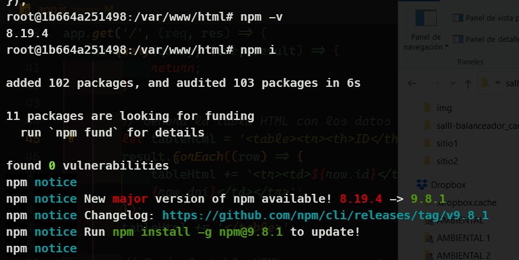


Como debemos saber la IP de nuestro contenedor **php:apache** para luego utilizarla en la configuración del balanceador, ejecutamos:

```
docker inspect Srv1
```

#### 3ro. Contenedor del servidor 2 de php:apache
Antes de crear el contenedor debemos tener en cuenta algunas configuraciones.
##### Configuración de la conexión 
En este paso debemos asegurarnos de que nuestro servidor tendrá una parte de código donde debemos configurar la conexión a la base de datos (al contenedor de nuestro sistema gestor de bases de datos).
La configuración es:
```
// Configuración de la conexión a la base de datos MySQL
const db = mysql.createConnection({
    host: '172.17.0.2',
    user: 'root',
    password: 'pass',
    database: 'prueba',
});

```

Vemos que la variable `db` **alojará un objeto que devuelve el método createConnection() de la biblioteca `mysql2`**. Este método es el encargado de realizar la conexión a nuestra base de datos y **dentro de esta conexión configuramos la ip del contenedor que ejecuta el sistema gestor de bases de datos**.
La clave `password="pass"` del objeto de configuración es la misma que la usada al crear el contenedor.

##### Creamos el contenedor

```
docker run -d -p 8088:82 --name Srv2 -v C:\sitio2:/var/www/html php:apache-bullseye
```

El comando anterior funciona en PowerShell. **Si estamos en CMD ejecutar**:
```
docker run -d -p 8088:82 --name Srv2 -v "C:\sitio2":/var/www/html php:apache-bullseye
```


Vemos que estamos creando un volumen, que persistirá los datos del sistema de archivos del contendor en la ruta `/var/www/html` en nuestro sistema de archivos de nuestra máquina local `C:\sitio2`

###### Importante:
Es en esta ruta (`C:\sitio2`) donde deberá estar alojado el servidor de **NodeJS**. Así el contenedor del servidor creado podrá servir nuestro sitio web que se conectará con la base de datos del contenedor mysql.
Atendiendo lo anterior, procedemos a **copiar los ficheros**: `package.json`, `package-lock.json` y `server.js` al directorio `C:\sitio2`.

##### Configuración del contenedor

Para ingresar al contenedor ejecutamos:
```
docker exec -it Srv2 bash
```

Actualizamos los paquetes instalados:
```
apt-get update
```


Observamos que los ficheros previamente copiados se encuentran dentro del servidor.


Ahora debemos instalar ciertos paquetes o "**drivers**" en este contenedor para que el servidor tenga la capacidad de ejecutar NodeJS:

###### Instalaciones dentro del contenedor
Para instalar Node utilizaremos **nvm** que es un gestor de versiones de Node. Por lo tanto, devemos instalar **nvm**. Sin embargo, para instalar nvm necesitaremos **curl**.

- Instalación de **`curl`**:
    ```
    apt-get install -y curl wget git build-essential
    ```


- Instalación de **`nvm`**:
    ```
    curl -o- https://raw.githubusercontent.com/nvm-sh/nvm/v0.39.5/install.sh | bash
    ```


- Instalación de **`NodeJS`** *(versión 16)*:
    ```
    nvm install 16
    ```


##### Otros
Finalmente, con todo lo anterior listo en nuestro contenedor, pasamos a instalar las dependencias de nuestro servidor (*conformado por los ficheros que se encuentran en `C:\sitio2`*).
Debemos ingresar al contenedor, en caso de haber salido anteriormente.
```
docker exec -it Srv2 bash
```

Y aquí instalamos las dependencias que serán utilizadas por nuestro servidor con **NodeJS**

```
npm i
```


Como debemos saber la IP de nuestro contenedor **php:apache** para luego utilizarla en la configuración del balanceador, ejecutamos:

```
docker inspect Srv2
```


#### 4to. Contenedor para el balanceador haproxy

##### Crear un directorio en nuestra máquina para mapear un volumen al contenedor del balanceador.
En mi caso:
```
C:\volumenBalanceador
```
 * Dentro de este directorio crear el fichero: **haproxy.cfg**
 * En este fichero colocar las configuraciones de nuestro balanceador:
```
global
    log 127.0.0.1 local0 notice
    pidfile /tmp/haproxy.pid
    daemon
defaults
    log global
    mode http
    option httplog
    option dontlognull
    timeout connect 5000
    timeout client 50000
    timeout server 50000
frontend http_front
    bind *:80
    mode http
    default_backend http_back
backend http_back
    balance roundrobin
    cookie JSESSIONID prefix indirect nocache
    server myServer 172.17.0.3:81 check
    server myServer2 172.17.0.4:82 check

```

	# **Asegurarse de dejar una línea en blanco al final del fichero para que exista un salto de línea en la última línea escrita.** 

##### Crear el contenedor:

```
docker run -d -p 8085:80 --name balancer -v "C:\volumenBalanceador":/usr/local/etc/haproxy/ haproxy:latest
```

Vemos que estamos creando un volumen, que persistirá los datos del sistema de archivos del contendor en la ruta `/usr/local/etc/haproxy/` en nuestro sistema de archivos de nuestra máquina local `C:\volumenBalanceador`

###### Importante:
Es en esta ruta (`C:\volumenBalanceador`) donde deberá estar alojado el fichero **haproxy.cfg**. Así, el contenedor del balanceador creado podrá controlar las peticiones que llegan a este y redirigirlas a los dos servidores que configuramos previamente. Al llegar una petición, el balanceador la redirigirá al servidor 1, al llegar la siguiente petición, la redirigirá al servidor 2, si llega otra petición, esta será redirigida al servidor 1; y así sucesivamente.

##### Comprobaciones
Ingresamos a los contenedores de los servidores, y ejecutamos lo servidores:
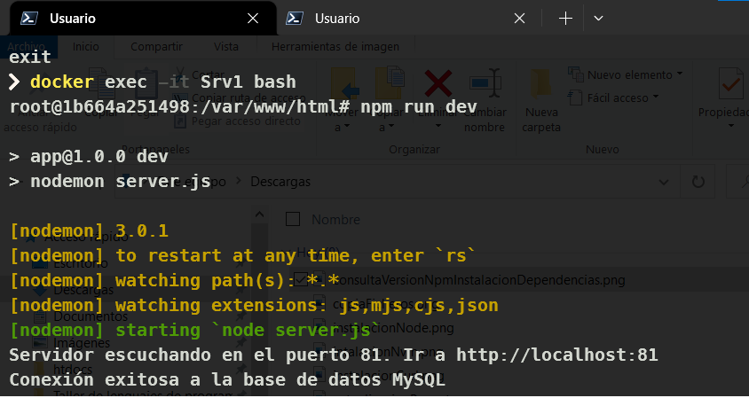

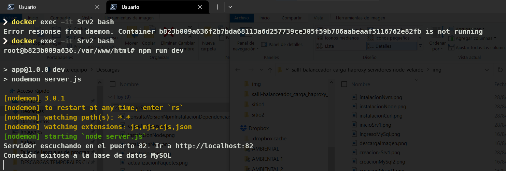

Nos dirigimos a la barra de navegación de nuestro explorador favorito e ingresamos a: `http://localhost:8085`:

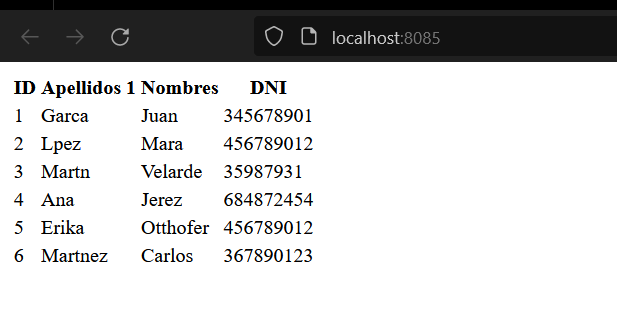

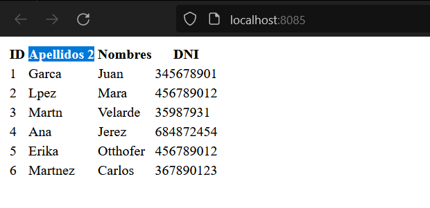
